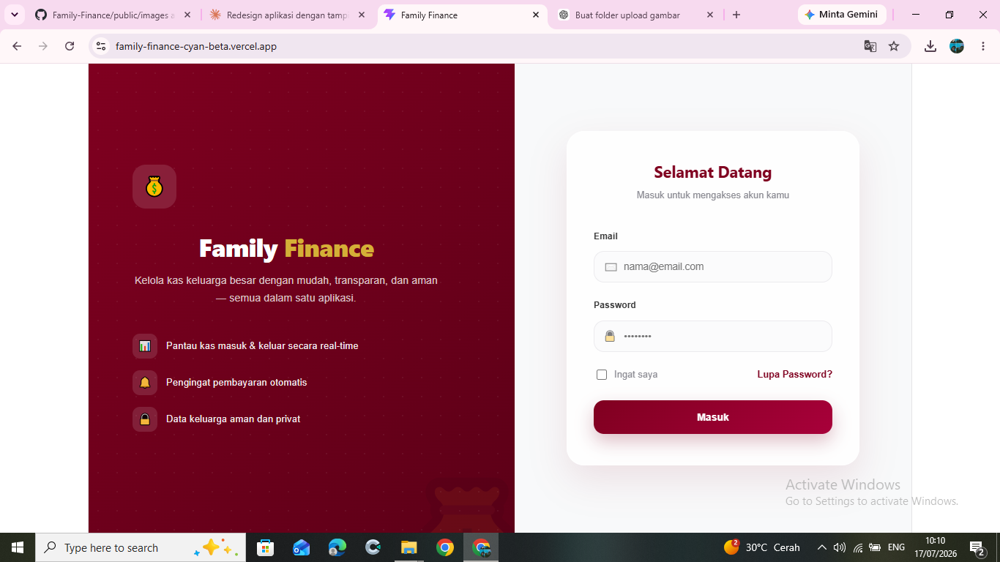
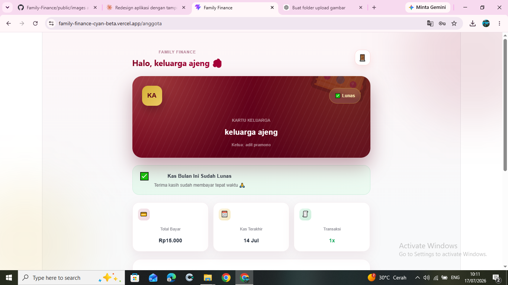

<div align="center">

# 💰 Family Finance
### Sistem Manajemen Keuangan Keluarga Berbasis Web

**Kelola keuangan keluarga lebih mudah, lebih rapi, dan lebih transparan dalam satu aplikasi digital.**

[](https://family-finance-cyan-beta.vercel.app)
[](https://react.dev)
[](https://vitejs.dev)
[](https://supabase.com)
[](https://vercel.com)

</div>

---

# 📌 Tentang Family Finance

**Family Finance** merupakan aplikasi web yang dirancang untuk membantu keluarga dalam mengelola keuangan secara digital. Aplikasi ini memudahkan pencatatan pemasukan, pengeluaran, pengelolaan anggota keluarga, jadwal kegiatan, pengingat pembayaran, hingga penyusunan laporan keuangan dalam satu dashboard yang modern dan mudah digunakan.

> Tidak perlu lagi mencatat keuangan secara manual. Semua transaksi dan laporan dapat dikelola secara digital, lebih cepat, aman, dan transparan.

---

# ✨ Fitur Utama

### 👨‍💼 Admin

- 🔐 Login Admin
- 📊 Dashboard Keuangan
- 👨‍👩‍👧 Manajemen Anggota Keluarga
- 💰 Kas Masuk
- 💸 Kas Keluar
- 📅 Jadwal Acara
- 🔔 Reminder Pembayaran
- 📈 Laporan Keuangan
- 📄 Export PDF
- 📊 Export Excel
- 💬 Generate Pesan WhatsApp
- ⚙️ Pengaturan Sistem

### 👤 Anggota

- 🔐 Login Anggota
- 📊 Dashboard
- 👤 Profil Anggota
- 💰 Melihat Riwayat Keuangan
- 📅 Melihat Jadwal Acara
- 📈 Melihat Laporan

---

# 🖥️ Screenshot

| Login | Dashboard Admin |
|---|---|
|  |  |

| Dashboard Anggota |
|---|
|  |

> **Pastikan gambar disimpan pada folder `public/images` dengan nama yang sesuai agar dapat ditampilkan di GitHub.**

---

# 🛠️ Tech Stack

| Teknologi | Kegunaan |
|-----------|----------|
| React 19 | Frontend Framework |
| Vite | Build Tool |
| Supabase | Database & Authentication |
| React Router DOM | Routing |
| Framer Motion | UI Animation |
| Recharts | Grafik |
| jsPDF | Export PDF |
| XLSX | Export Excel |
| html2canvas | Generate PDF |
| Vercel | Hosting & Deployment |

---

# 🔐 Akses Demo

Gunakan akun berikut untuk mencoba aplikasi.

| Role | Email | Password |
|------|-------|----------|
| 👨‍💼 **Admin** | `admin@familyfinance.com` | `admin123` |
| 👤 **Anggota** | `ajeng@familyfinance.com` | `ajeng123` |

---

# 🚀 Cara Menjalankan Project

### 1. Clone Repository

```bash
git clone https://github.com/vickyagstn/Family-Finance.git
```

### 2. Masuk Folder Project

```bash
cd Family-Finance
```

### 3. Install Dependency

```bash
npm install
```

### 4. Buat Environment Variables

Buat file `.env` kemudian isi:

```env
VITE_SUPABASE_URL=YOUR_SUPABASE_URL
VITE_SUPABASE_ANON_KEY=YOUR_SUPABASE_ANON_KEY
```

### 5. Jalankan Project

```bash
npm run dev
```

---

# ☁️ Deploy

Project ini di-deploy menggunakan **Vercel**.

🌐 **Live Demo**

https://family-finance-cyan-beta.vercel.app

---

# 📁 Struktur Project

```text
Family-Finance
│
├── public
│   └── images
│       ├── login.png
│       ├── dashboard-admin.png
│       └── dashboard-anggota.png
│
├── src
│   ├── components
│   ├── pages
│   ├── assets
│   ├── hooks
│   ├── services
│   ├── utils
│   └── App.jsx
│
├── package.json
└── README.md
```

---

# 🗺️ Roadmap

- ✅ Login Multi Role
- ✅ Dashboard Admin
- ✅ Dashboard Anggota
- ✅ Kas Masuk
- ✅ Kas Keluar
- ✅ Laporan Keuangan
- ✅ Export PDF
- ✅ Export Excel
- ✅ Jadwal Acara
- ✅ Reminder Pembayaran
- ⏳ Notifikasi WhatsApp Otomatis
- ⏳ Backup Database
- ⏳ Dark Mode

---

# 👨‍💻 Author

**Vicky Agustine**

GitHub: https://github.com/vickyagstn

---

<div align="center">

Dibuat dengan ❤️ menggunakan **React, Supabase, dan Vite**

⭐ Jangan lupa berikan **Star** jika repository ini bermanfaat.

</div>
